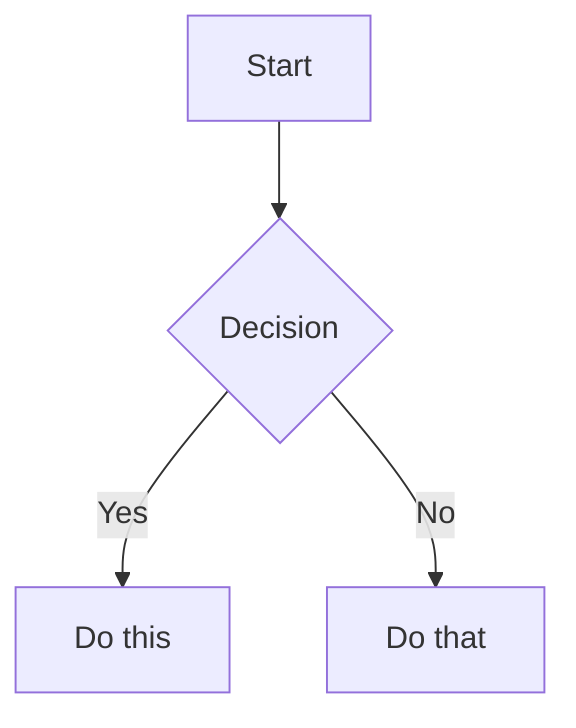
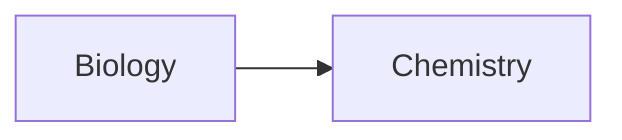
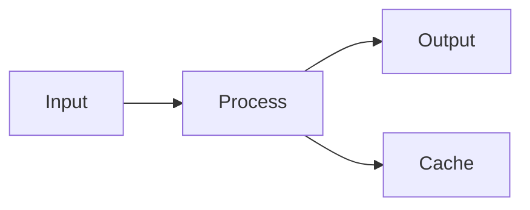

# Obsidian Flavored Markdown Skill

This skill enables skills-compatible agents to create and edit valid Obsidian Flavored Markdown, focusing on Obsidian-specific syntax extensions beyond standard Markdown.

## Overview

Obsidian layers the following on top of CommonMark and GitHub Flavored Markdown:
- **Wikilinks & Embeds** — internal linking and transclusion
- **Callouts** — styled admonition blocks
- **Properties** — YAML frontmatter with typed fields
- **Block IDs** — linkable anchors within notes
- [LaTeX](https://www.latex-project.org/) math rendering
- [Mermaid](https://mermaid.js.org/) diagrams
- Obsidian comments (`%% ... %%`)

Standard Markdown (headings, bold/italic, lists, code blocks, tables) is assumed knowledge and is not covered here.

---

## Internal Links (Wikilinks)

### Basic Links

```markdown
[[Note Name]]
[[Note Name.md]]
[[Note Name|Display Text]]
```

### Link to Headings

```markdown
[[Note Name#Heading]]
[[Note Name#Heading|Custom Text]]
[[#Heading in same note]]
```

### Link to Blocks

```markdown
[[Note Name#^block-id]]
[[Note Name#^block-id|Custom Text]]
```

Define a block ID by appending `^block-id` at the end of a paragraph:

```markdown
This is a paragraph that can be linked to. ^my-block-id
```

For lists and blockquotes, place the block ID on the line immediately after:

```markdown
> This is a quote
> with multiple lines

^quote-id
```

### Obsidian URI Links

```markdown
[Open Note](obsidian://open?vault=VaultName&file=Note.md)
```

Note: spaces in standard Markdown links must be URL-encoded as `%20`.

---

## Embeds

Embed a note, heading, or block using `![[...]]`:

```markdown
![[Note Name]]
![[Note Name#Heading]]
![[Note Name#^block-id]]
```

### Image Embeds

```markdown
![[image.png]]
![[image.png|300]]          Width only (maintains aspect ratio)
![[image.png|640x480]]      Width × Height
```

### PDF Embeds

```markdown
![[document.pdf]]
![[document.pdf#page=3]]
![[document.pdf#height=400]]
```

### Audio/Video Embeds

```markdown
![[audio.mp3]]
![[audio.ogg]]
![[video.mp4]]
```

### Embed Search Results

````markdown
```query
tag:#project status:done
```
````

---

## Callouts

### Basic Callout

```markdown
> [!note]
> Default title matches the callout type.

> [!info] Custom Title
> Override the title with text after the type.

> [!tip] Title Only
```

### Foldable Callouts

```markdown
> [!faq]- Collapsed by default
> Hidden until the user expands it.

> [!faq]+ Expanded by default
> Visible but collapsible.
```

### Nested Callouts

```markdown
> [!question] Outer callout
> > [!note] Inner callout
> > Nested content here.
```

### Supported Callout Types

| Type | Aliases | Appearance |
|------|---------|------------|
| `note` | — | Blue, pencil icon |
| `abstract` | `summary`, `tldr` | Teal, clipboard icon |
| `info` | — | Blue, info icon |
| `todo` | — | Blue, checkbox icon |
| `tip` | `hint`, `important` | Cyan, flame icon |
| `success` | `check`, `done` | Green, checkmark icon |
| `question` | `help`, `faq` | Yellow, question mark |
| `warning` | `caution`, `attention` | Orange, warning icon |
| `failure` | `fail`, `missing` | Red, X icon |
| `danger` | `error` | Red, zap icon |
| `bug` | — | Red, bug icon |
| `example` | — | Purple, list icon |
| `quote` | `cite` | Gray, quote icon |

### Custom Callouts (CSS)

```css
.callout[data-callout="custom-type"] {
  --callout-color: 255, 0, 0;
  --callout-icon: lucide-alert-circle;
}
```

---

## Properties (Frontmatter)

Properties are defined in a YAML block at the very start of the file:

```yaml
---
title: My Note Title
date: 2024-01-15
tags:
  - project
  - important
aliases:
  - My Note
  - Alternative Name
cssclasses:
  - custom-class
status: in-progress
rating: 4.5
completed: false
due: 2024-02-01T14:30:00
---
```

### Property Types

| Type | Example |
|------|---------|
| Text | `title: My Title` |
| Number | `rating: 4.5` |
| Checkbox | `completed: true` |
| Date | `date: 2024-01-15` |
| Date & Time | `due: 2024-01-15T14:30:00` |
| List | `tags: [one, two]` or YAML block list |
| Links | `related: "[[Other Note]]"` |

### Built-in Properties

| Property | Purpose |
|----------|---------|
| `tags` | Searchable note tags |
| `aliases` | Alternative names for wikilink matching |
| `cssclasses` | CSS classes applied to the note in reading view |

---

## Tags

```markdown
#tag
#nested/tag
#tag-with-dashes
#tag_with_underscores
```

Tags can contain letters (any language), numbers (not as first character), `_`, `-`, and `/` for nesting. Define tags inline or in frontmatter:

```yaml
---
tags:
  - project
  - nested/subtag
---
```

---

## Obsidian Comments

Comments are hidden in Reading view and exports:

```markdown
Visible text %%hidden comment%% more visible text.

%%
This entire block is hidden.
Useful for internal notes or drafts.
%%
```

---

## Math (LaTeX)

Inline math uses single `$`, block math uses `$$`:

```markdown
Inline: $e^{i\pi} + 1 = 0$

$$
\frac{a}{b} = \sqrt{x^2 + y^2}
$$
```

Common syntax:

```markdown
$x^2$              Superscript
$x_i$              Subscript
$\frac{a}{b}$      Fraction
$\sqrt{x}$         Square root
$\sum_{i=1}^{n}$   Summation
$\int_a^b$         Integral
$\alpha, \beta$    Greek letters
```

---

## Diagrams (Mermaid)

````markdown

````

Mark nodes as internal links with the `internal-link` class:

````markdown

````

---

## Troubleshooting Common Issues

| Problem | Likely Cause | Fix |
|---------|-------------|-----|
| Wikilink shows as plain text | Note name doesn't match any file in vault | Verify filename and path; use the exact name (case-sensitive on some systems) |
| Embed shows "No content" | Block ID not defined or misspelled | Confirm `^block-id` appears at the end of the target paragraph |
| Frontmatter not parsed | YAML block not at line 1, or syntax error | Ensure `---` delimiters start on line 1 with no preceding blank line; validate YAML (no tabs, correct indentation) |
| Callout not rendered | Type misspelled or extra space | Use `> [!type]` with no space before `[!` and a valid type from the table above |
| Tag not indexed | Starts with a number or contains spaces | Tags must not start with a digit; use `-` or `_` instead of spaces |

---

## Complete Example

````markdown
---
title: Project Alpha
date: 2024-01-15
tags:
  - project
  - active
status: in-progress
aliases:
  - Alpha Project
---

# Project Alpha

> [!important] Key Deadline
> First milestone due ==January 30th==. See [[Milestones#Q1 Goals|Q1 Goals]].

## Tasks

- [x] Initial planning ^planning-block
- [ ] Development phase
  - [ ] Backend implementation
  - [ ] Frontend design
- [ ] Testing and deployment

## Technical Design

Core sort complexity: $O(n \log n)$



## Related

- ![[Meeting Notes 2024-01-10#Decisions]]
- [[Budget Allocation|Budget]]
- [[Team Members]]

%%
Internal: review with team Friday before sharing.
%%
````

---

## References

- [Basic formatting syntax](https://help.obsidian.md/syntax)
- [Advanced formatting syntax](https://help.obsidian.md/advanced-syntax)
- [Obsidian Flavored Markdown](https://help.obsidian.md/obsidian-flavored-markdown)
- [Internal links](https://help.obsidian.md/links)
- [Embed files](https://help.obsidian.md/embeds)
- [Callouts](https://help.obsidian.md/callouts)
- [Properties](https://help.obsidian.md/properties)
